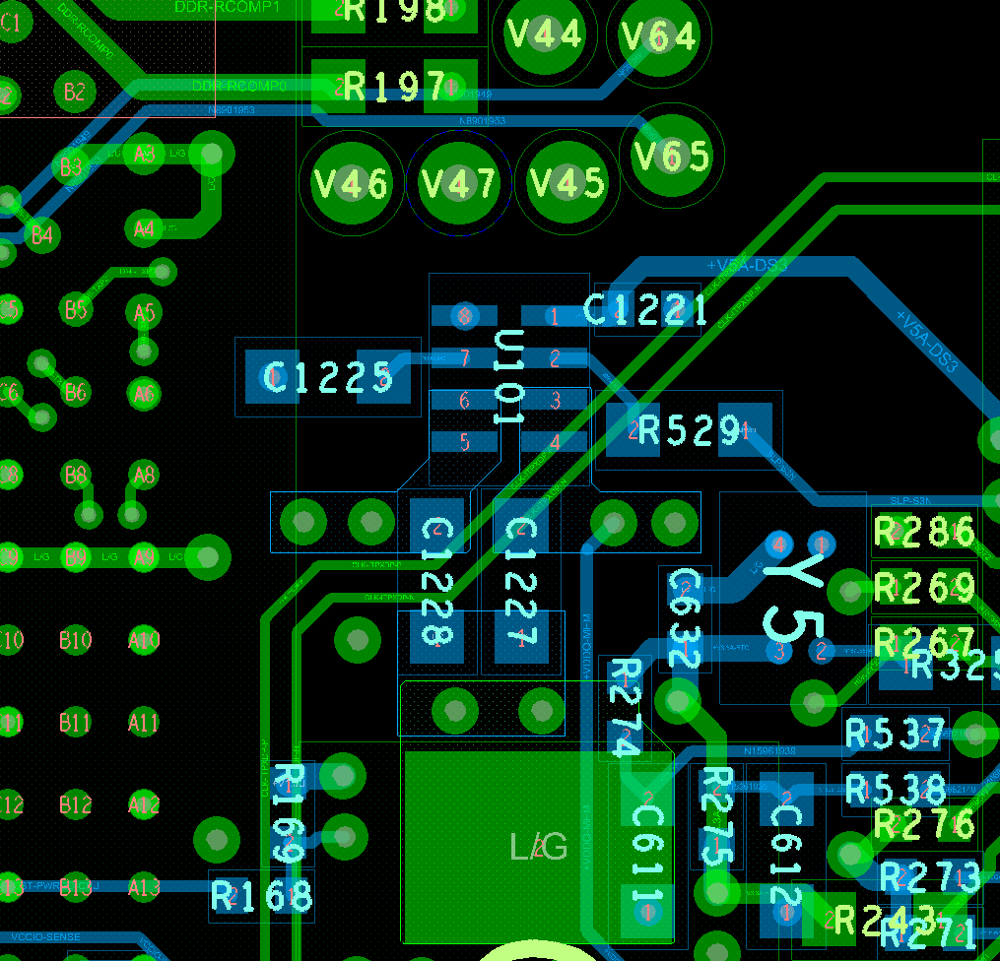

# OrCAD  / Allegro PCB Layout Review Beautifier 

The project provides a script and GUI that makes a PCB layout, created in either [OrCAD](https://www.orcad.com/) or [Allgero](https://www.cadence.com/en_US/home/tools/pcb-design-and-analysis/pcb-layout/allegro-pcb-designer.html) much easier to read and review. It is also great for hardware debugging.  Note that the OrCAD and Allegro PCB layout tools are [both owned by Cadence and use interchangeable file formats](https://community.cadence.com/cadence_technology_forums/f/pcb-design/22857/orcad-vs-allegro).

* *It has NO effect on the fabrication and manufacturing layers (eg ASSEMBLY, SILKSCREEN)*
* orients, centers, and automatically sizes the REFDES's and pin designations on the TOP DISPLAY layer
* orients, changes to forward direction, centers, and automatically sizes the REFDES's and pin designations on the BOTTOM DISPLAY layer
* gives easy control of the colors used for the display layer via a set of three +/- buttons for Hue, Saturation, and Lightness ([HSL](https://en.wikipedia.org/wiki/HSL_and_HSV)).

The script is written in [Cadence SKILL](https://en.wikipedia.org/wiki/Cadence_SKILL), which is a variant of [Lisp](https://en.wikipedia.org/wiki/Lisp_(programming_language)).

## INSTALLATION 

1. Download `PCBReview.il`. This is the Skill script.

If your installation has a skill folder, e.g `C:\Cadence\[VERSION]\setup\skill`, place the file there.

## USAGE 

1. Open the OrCAD (or allegro) layout tool.
2. At OrCAD (or allegro) layout command prompt, type `load("[path]/PCBReview.il")`, where `[path]` is the full path to the folder that you saved the file in.
3. Type `PCBReview` at the OrCAD layout command prompt.
4. The modifications to the DISPLAY layers described above will take place.
5. Afterward completion, the following popup window will appear which allows control of the colors and other display features.

### allegro.ilinit [optional]

1. Place the load command above in your `allegro.ilinit` in your `PCBENV\` folder (it may be named `pcbenv\` instead).  Perform a file search if you're not sure where it resides.
or
2. Dowload and merge the contents of  `allegro.ilinit` with the file of the same name in your `PCBENV\` folder (it may be named `pcbenv\` instead).  This file loads all the scripts in the `C:\Cadence\setup\skill` folder during initialization of the OrCAD Layout application.  (`allegro.ilinit` is the initialization file for OrCAD Layout.)  Be sure to change  `C:\Cadence\setup\skill` to the path where your skill scripts reside.

## EXAMPLE RESULT

